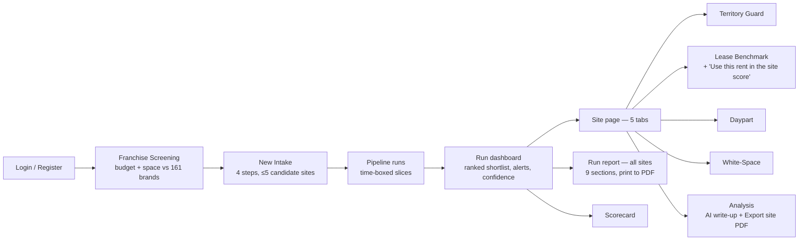
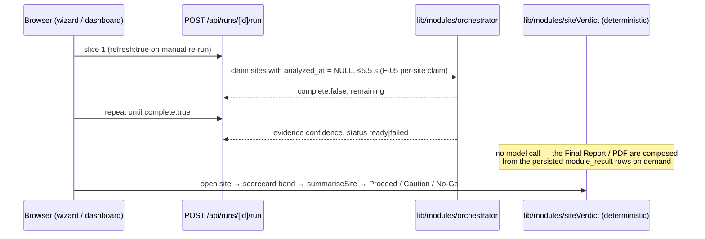

# BSA — Development Handoff

For Grid's development team. What the prototype is, how it works, the decisions behind it, and what is
left before production. Companion docs: [`API_REFERENCE.md`](API_REFERENCE.md) ·
[`DATA_DICTIONARY.md`](DATA_DICTIONARY.md) · [`SECURITY_POSTURE.md`](SECURITY_POSTURE.md) ·
[`../PROJECT_MEMORY.md`](../PROJECT_MEMORY.md) · [`../WORKLOG.md`](../WORKLOG.md).

_Status as of 2026-09-23: code review complete (5 fix batches). 331 unit tests, strict typecheck clean,
production build passes._

---

## 1. The user journey

Pages: `/screening`, `/intake`, `/runs` (dashboard), `/site`, `/modules` (all module scores),
`/scorecard`, `/reports` (run report), `/explore`, `/settings`. Retired 2026-09-23 (features live as site
tabs): `/territory-guard`, `/lease-benchmark`, `/daypart`, `/whitespace`.

## 2. How a run works

- **Per site:** Site Fit → Territory → Lease → Daypart → (Informal / Healthcare / Mall / Land by vertical)
  → White-Space → composite. Each module is isolated; failures go to `candidate_site.pipeline_error` and
  show as a dashboard alert.
- **Composite** (`lib/modules/scorecard.ts`): Site Fit 30% · Territory 25% (inverted) · Lease 20% (value
  score, only once an asking rent is saved) · Daypart 10% · Informal 10% · Land 5%, renormalised over
  what scored. ≥65 GO, ≥45 CAUTION. Capped at 64 when Site Fit can't score.
- **Confidence** = decision-weighted evidence (Verified 1 · Assumed 0.7 · Projected 0.35 · missing 0),
  High ≥ 0.75, Medium ≥ 0.5, one band lower when an on-ground check is advised.
- **Recommendation (deterministic, no LLM):** the scorecard band → `lib/modules/siteVerdict.ts`
  (`summariseSite`) phrases the Proceed / Proceed with caution / No-Go call and the Final Report from the
  retrieved keywords, findings and numbers — never inventing a value. Dashboard band and Final Report read
  the same band, so they always agree (F-07). The external VectorShift analysis was removed (Sep 2026);
  `ai_generation` / `pipeline_usage` are deprecated (see DATA_DICTIONARY).
- **Monitoring (F-51):** unexpected server errors and uncaught client errors flow through
  `lib/monitoring/report.ts` (structured log + optional `ERROR_WEBHOOK_URL`/`SENTRY_DSN`); swap that one
  module for `@sentry/nextjs` without touching call sites.

## 3. Decisions worth keeping (and why)

| Decision | Why |
|---|---|
| Truth Layer is a column on every reference/result row; labels come from the data rows | Brokers must be able to defend every figure to a client |
| No price verdicts — lease is described by position vs the corridor | Grid guardrail; the licensed broker judges price (RA 9646) |
| BIR zonal = tax-reference floor only | It is a tax base, not a market value |
| Guardrail wording only in `lib/truth/guardrailCopy.ts` | One place to change legal/brand wording |
| Pipeline in 5.5 s slices; AI one site per request | Netlify synchronous function limits |
| Reports rebuilt on demand, nothing stored | Serverless disk is temporary; no bucket to run |
| Typed outlets belong to their intake; independent/added brands are private to their creator | Tenant privacy on shared catalogue brands |
| Demo logins never on deployments | The demo password is public in the repo |
| DB-backed login rate limiting via `audit_log` | Works across serverless instances without new infra |

## 4. Known limitations / next work (prioritised)

1. **Security** — see `SECURITY_POSTURE.md` open items (Google key rotation, nonce CSP, session
   revocation, edge rate limiting, dependency scanning).
2. **pgvector is not used yet.** `doc_chunk.embedding` + HNSW index exist, but retrieval is keyword-only
   (`tsvector`). Add an embedding provider and hybrid search when the corpus grows.
3. **White-Space performance.** Scores every candidate area against all competitor POIs in JS for each
   site (O(areas × POIs)). Fine for NCR at prototype scale; move the tiering into SQL (or compute once
   per run) before national scale.
4. **Data gaps.** San Juan zonal values missing; Valenzuela barangay grain missing; demographics are
   barangay-level estimates (Assumed); lease comps 80 rows / 15 corridors.
5. **API-first.** Several server components read Prisma directly (not via `/api/*`). Access checks are
   applied, nothing leaks to the browser, but production should route page data through the API layer.
6. **Two report outputs by design:** Run report (all sites, `/reports`, print-to-PDF HTML) and the
   per-site Analysis PDF. Keep both clearly labelled.
7. **Object storage adapter** (`lib/storage`) is local-FS only; add S3/R2 if uploads or archives return.

## 5. Pre-production checklist

- [ ] `npx prisma migrate deploy` on the production database; `npm run db:seed-methodology`.
- [ ] Netlify env: `DATABASE_URL` (pooled) + `DIRECT_URL` (direct, for `migrate deploy` and bulk loaders),
      `AUTH_SECRET` (32+), `AUTH_MODE=db`, `GOOGLE_API_KEY`. Optional: `ERROR_WEBHOOK_URL`/`SENTRY_DSN`.
      No AI keys — the recommendation is deterministic.
- [ ] Function timeout ≥ 26 s (or `VECTORSHIFT_TIMEOUT_MS` below it).
- [ ] Browser smoke test: login → intake → dashboard → site tabs → Analysis → Export site PDF → Run report.
- [ ] CSP: no blocked resources in the console (use `BSA_CSP_REPORT_ONLY=1` while diagnosing).
- [ ] Rotate the Google API key and any passwords from the old public dump.
- [ ] Re-run analyses created before 2026-09-23 (dashboard ↻ Re-run analysis) to pick up the new scoring.
- [ ] `npm audit`, then CI with `npm run typecheck && npm test && npm run build`.
